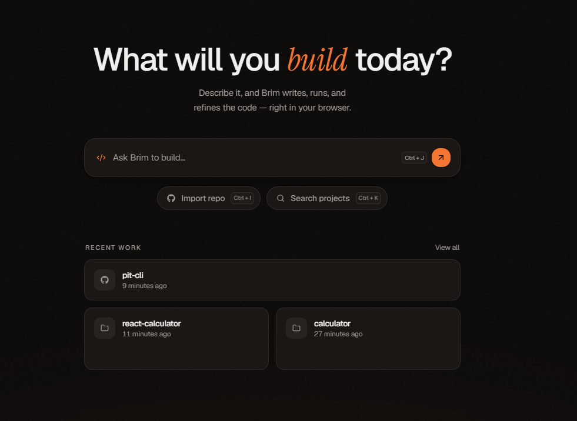
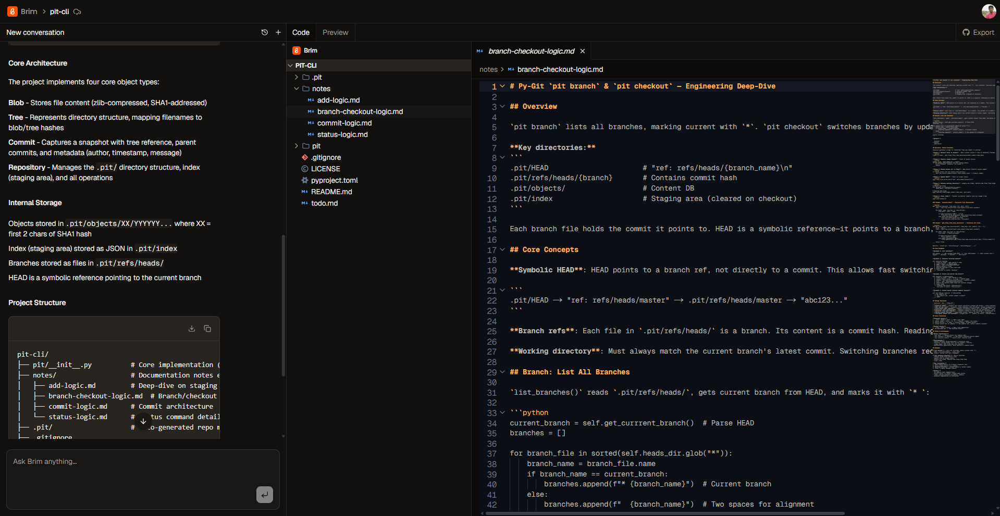

<div align="center">
  

  # Brim - AI-Powered Browser IDE
  
  Real-time collaborative code editing, AI-powered suggestions, in-browser execution, and seamless GitHub integration.
</div>


Brim is a next-generation, browser-based IDE designed to supercharge your development workflow. It combines real-time collaborative editing, an intelligent AI conversation assistant, seamless in-browser code execution via WebContainers, and robust native GitHub import/export capabilities.

<div align="center">
  
</div>

## ✨ Key Features

* **GitHub Import & Export:** Instantly pull existing repositories directly into the browser and export your edits back to GitHub.
* **Real-time Collaboration:** Code together seamlessly with instant updates.
* **AI-Powered Code Suggestions:** Ghost text autocomplete and quick-edit capabilities (`Cmd+K`).
* **Conversational AI Assistant:** Built-in sidebar for contextual help, debugging, and generation.
* **In-Browser Execution:** Run your code entirely in the browser using WebContainer API.
* **Multi-file Management:** VSCode-style project management with tabs, folders, and icons.

## 🛠 Tech Stack

| Category      | Technologies                                                 |
| ------------- | ------------------------------------------------------------ |
| **Frontend** | Next.js 16, React 19, TypeScript, Tailwind CSS 4             |
| **Editor** | CodeMirror 6, Custom Extensions, One Dark Theme              |
| **Backend** | Convex (Real-time DB), Inngest (Background Jobs)             |
| **AI** | Claude Sonnet 4 (preferred) or Gemini 2.0 Flash (free tier)  |
| **Execution** | WebContainer API, xterm.js                                   |
| **UI** | shadcn/ui, Radix UI                                          |

## 💻 Editor & Core Capabilities

<div align="center">
  
</div>

### Version Control & GitHub Integration
* **1-Click Import:** Clone public or private GitHub repositories directly into your Brim workspace.
* **Seamless Export:** Push your project updates and newly created files back to GitHub without leaving the browser. 
* **Branch Management:** *[Optional/Planned: Mention if applicable]* Easy syncing with your codebase version history.

### Intelligent AI
* **Ghost Text:** Real-time, context-aware code completions as you type.
* **Quick Edit:** Select code and use natural language instructions (`Cmd+K`) to refactor or generate logic.
* **Selection Tooltip:** High-speed quick actions tailored to your selected code block.
* **Contextual Chat:** A conversational sidebar that remembers your project's history.

### The Editing Experience
* Rich syntax highlighting for JS, TS, CSS, HTML, JSON, Markdown, and Python.
* Code folding, minimap overview, bracket matching, and indentation guides.
* Multi-cursor editing for rapid changes.

### File & State Management
* Full file explorer with hierarchical folder structures.
* Create, rename, delete files and folders with auto-save and debouncing.
* Instant state synchronization across clients powered by **Convex**, with optimistic UI updates.

---

## 🚀 Getting Started

### Prerequisites
Before you begin, ensure you have the following installed and set up:
* **Node.js:** v20.09 or higher
* **Package Manager:** npm or pnpm
* **External Accounts:**
    * [Convex](https://convex.dev) (Database)
    * [Inngest](https://inngest.com) (Background jobs)
    * [Anthropic](https://anthropic.com) or [Google AI Studio](https://aistudio.google.com) (AI API)
    * *[Optional]* [Firecrawl](https://firecrawl.dev) (Web scraping)

### Installation & Setup

1. **Clone the repository:**
   ```bash
   git clone [https://github.com/whynotramaa/brim.git](https://github.com/whynotramaa/brim.git)
   cd brim

```

2. **Install dependencies:**
```bash
npm install

```


3. **Configure Environment Variables:**
Create a `.env.local` file in the root directory:
```bash
touch .env.local

```


Add the following required keys to your `.env.local`:
```env
# Convex Configuration
NEXT_PUBLIC_CONVEX_URL=
CONVEX_DEPLOYMENT=
BRIM_CONVEX_INTERNAL_KEY=  # Generate a secure random string

# AI Provider (Choose one)
ANTHROPIC_API_KEY=         # Preferred - Claude Sonnet 4
OPENCODE_ZEN_API_KEY=      # Free alternative - Deepseek v4 Flash

# Web Scraping (Optional)
FIRECRAWL_API_KEY=

```


4. **Start the Development Servers:**
You will need three terminal windows to run all necessary services.
*Terminal 1: Start Convex*
```bash
npx convex dev

```


*Terminal 2: Start Inngest*
```bash
npx inngest-cli@latest dev

```


*Terminal 3: Start Next.js App*
```bash
npm run dev

```


5. **Open Brim:** Navigate to [http://localhost:3000](http://localhost:3000) in your browser.

---

## 📂 Project Structure

```text
brim/
├── src/
│   ├── app/                    # Next.js App Router
│   │   ├── api/                # API routes (messages, suggestions, quick-edit)
│   │   └── projects/           # Project views
│   ├── components/             # Shared UI & AI-specific components
│   ├── features/               # Domain-specific logic
│   │   ├── auth/               # Authentication
│   │   ├── conversations/      # AI chat system
│   │   ├── editor/             # CodeMirror & extensions
│   │   ├── preview/            # WebContainer execution
│   │   └── projects/           # Project management
│   ├── inngest/                # Inngest client configurations
│   └── lib/                    # Shared utilities
└── convex/                     # Backend Database Logic
    ├── schema.ts               # Database schema definitions
    ├── projects.ts             # Project queries/mutations
    ├── files.ts                # File operations
    ├── conversations.ts        # Conversation operations
    └── system.ts               # Internal API for Inngest

```

## 📜 Available Scripts

| Command | Description |
| --- | --- |
| `npm run dev` | Starts the development server. |
| `npm run build` | Builds the application for production. |
| `npm run start` | Starts the production server. |
| `npm run lint` | Runs ESLint to check for code issues. |

## 🤝 Acknowledgments

This project stands on the shoulders of incredible tools and inspiring products:

* [Cursor](https://cursor.sh) & [Orchids](https://orchids.app) - For inspiring the vision of AI-native editing.
* [shadcn/ui](https://ui.shadcn.com) - For the beautiful, accessible UI components.
* [CodeMirror](https://codemirror.net) - For the robust code editor framework.

---

<p align="center">
Made with <3 by Rama
</p>
